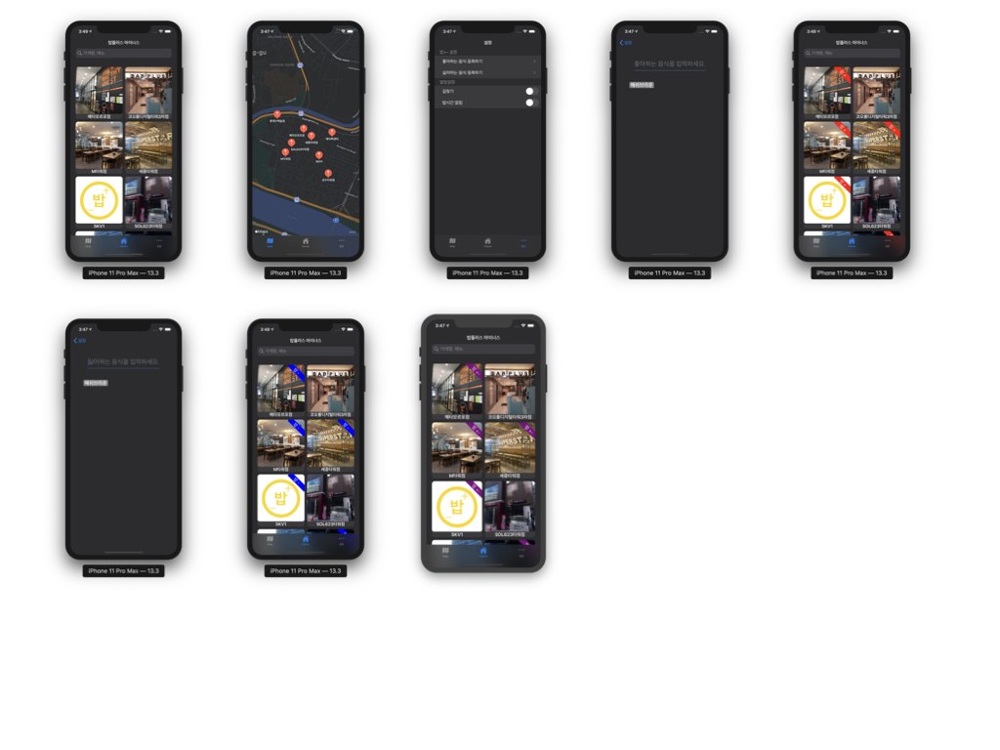

# 홍동현

나의 서비스를 사용하는 유저를 신뢰하지 않는다는 마음가짐으로 개발합니다.

## Contact

- Email: hong3@kakao.com
- Blog: https://hongdonghyun.github.io/about/

## 소개

Backend Developer로 1년정도 근무후,

Swift의 Optional과 Guard 문법이 마음에 들어 패스트캠퍼스 iOS School을 통해 Swift 공부를 시작했습니다.

개발 욕심이 많으며, 
도움 되었다는 말을 들었을때 가장 뿌듯합니다.

# 보유기술

**언어:**    Swift, Python

**라이브러리:** Alamofire, Kingfisher, SnapKit, SwiftLint, Then

**데이터베이스:** SQLite, Mysql, Postgresql

**그외:**  Git, Backend개발 경험, AWS

## 관심분야

- Vapor를 사용해 웹사이트 띄우기에 도전하고 있습니다.
- Swift 테스트코드를 작성해보고 있습니다.

# 경력

- 헤렌
  - 기간: 2018.06 ~ 2019.08
  - 역할: Backend Developer
  - 프로젝트: [인스타겟](https://www.instaget.com/), [파인앳플](https://www.fineadple.com/)

# 프로젝트

## 회사 프로젝트

## 인스타겟
인플루언서 마케팅 서비스

#### 기간
- 2018.06 ~ 2019.06

#### 개발 환경
- Pycharm

#### 개발 스펙
- 사용언어: Python, Javascript
- 프레임워크: Flask
- 데이터베이스: Mysql, Postgresql, RabbitMQ

#### 상세 업무
- 기존 서비스의 유지보수 및 기능개발
- 서비스의 안정화
- 소셜 로그인
- admin 페이지 성능향상, 특정 페이지 로딩 속도 40초 -> 9초로 개선
- CS팀 백오피스를 기획/개발, CS팀과의 불필요한 소통시간 단축
- 데이터 크롤링

## 파인앳플
인플루언서와 광고주를 연결해주는 서비스

#### 기간
2019.06 ~ 2019.08

#### 개발환경
Pycharm

#### 개발 스펙
- 사용언어: Python, Javascript
- 프레임워크: Django, vue.js, JQuery
- 데이터베이스: Postgresql

#### 상세 업무
- admin 페이지 안정화 작업
- API서버의 개발 마무리 작업
- 배포 자동화
- 프로덕션, 개발서버 분리

### 데이터 이관 작업
공비서 서비스의 고객 데이터 이관작업

#### 기간
- 2019.06 ~ 2019.01

#### 개발환경
- Pycharm

#### 개발 스펙
- 사용언어: Python
- 사용 라이브러리: Beautifulsoup, Selenium

#### 상세 업무
- 타서비스의 데이터 이관작업
- 고객별로 데이터 구조 설계
- 스크래핑을 위한 타서비스 구조 분석
- 데이터 수집
- 업체별 스크래핑 코드 모듈화

## 개인/팀 프로젝트

### 마켓브로콜리
- 마켓컬리 Clone
- 협업 프로젝트

### 기간

- 2020.03.31 ~ 2020.04.29  

### 설명

- 가장 보편적인 형태의 e-commerce 앱 클론코딩
- 실제 앱 구조를 파악, 구현하며 보편적인 UI를 만드는 연습 진행
- 팀원간의 커뮤니케이션 방법과 팀간의 커뮤니케이션 방법에 대해 고민하는 계기가 되었음

[더 궁금하시다면](https://github.com/hongdonghyun/iOS-team3)👀
 
### 스크린샷

 

### 앱스토어 카피

### 기간
- 2020.03.02 ~ 2020.03.13

### 설명

- 패스트캠퍼스 해커톤 자체 평가 2위
- TableView와 CollectionView를 사용하여 개발
- 테스트 코드 적용

[더 궁금하시다면](https://github.com/hongdonghyun/AppStore-Copy)👀

### 스크린샷

 

### 밥플러스 마이너스

### 기간
- 2020.02.13 ~ 2020.03.13

### 설명

- 밥플러스 지점들의 식단표를 보기위해 만든앱

[더 궁금하시다면](https://github.com/hongdonghyun/babplus)👀

### 스크린샷
 
 

### 날씨앱

### 기간
- 2020.02.24 ~ 2020.02.27

### 설명

- 현재위치 날씨와 단기예보를 보여주는 앱

[더 궁금하시다면](https://github.com/hongdonghyun/WeatherApp)👀

### 스크린샷

  

# 활동

- [Swift 알고리즘 스터디](https://www.notion.so/ea8b1b247dc34cf79ef5b20dbb493d90) | 2020.05 ~ 진행중
- [Swift 기본 문법 스터디](https://github.com/TheSwifters/iOS-Study) | 2020.02 ~ 2020.03
- [패스트캠퍼스 바이트 디그리 Python&Django 조교](https://www.fastcampus.co.kr/courses/202658) | 2019.06 ~ 진행중
- 패스트캠퍼스 컴퓨터공학 Extension School 조교 | 2018.06 ~ 2019.03

# 학력
- Fastcampus iOS School 10기 수료(2019.11 ~ 2020.04)
- 강원대학교 전기전자공학과 졸업(2010.03 ~ 2017.02)